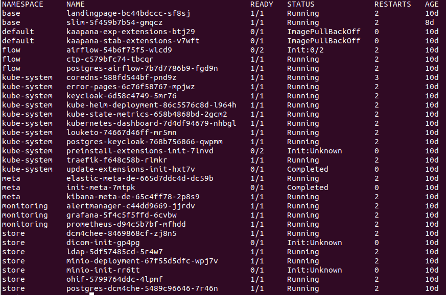
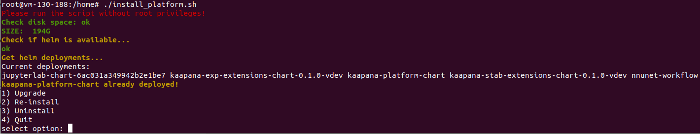
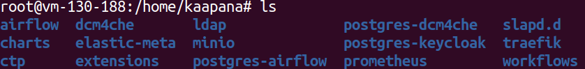

.. _faq_doc:

Frequently Asked Questions (FAQ)
================================

There seems to be something wrong with the landing-page visualization in the Browser
------------------------------------------------------------------------------------

Most probably the Browser-Version is not supported. We try to support as many Browsers as possible. If the problem persists, an overview of running pods on the server provides further information. 
Running pods can be viewed via:
::
    kubectl get pods -all-namespaces

To access the platform, at least the landingpage, keycloak and louketo must be running.

More detailed information about the status of a pod is provided by:
:code:`kubectl -n <THE NAMESPACE> logs <NAME OF THE POD>`
:code:`kubectl -n <THE NAMESPACE> describe pods <NAME OF THE POD>`
A pod can be deleted via:
:code:`kubectl -n <THE NAMESPACE> delete pods <NAME OF THE POD>`

Un-/ reinstall the platform
---------------------------
Uninstalling and reinstalling the platform is done by re-running the :term:`platform-installation-script`, which is located at
:code:`kaapana/platforms/kaapana-platform/platform-installation/install_platform.sh`.
Execute the script again:
:code:`./install_platform.sh`

Choose the preferred option 
1. For Upgrading the platform select :code:`1`
2. For Re-installation of the platform select :code:`2`
3. For Uninstalling the platform select :code:`3`
4. Quit via :code:`4`

Upgrading the platform performs a :code:`helm upgrade`, while reinstalling the platform deletes the current deployment and installs the platform again. 
 

Kibana dashboard does not work
------------------------------

You open Kibana/Meta and you see something like this?

.. figure:: _static/img/kibana_bug.png
   :align: center
   :scale: 25%

The error occurred, because the dashboard was opened while not all the meta-data of the images were extracted. You can resolve this by going to

::

    https://<server-domain>/meta

this is the Kibana dashboard. Select "Management" on the left hand side and then "Index Patterns''. Then you should see a panel called "meta-index". On the top right corner there
is a refresh button. By clicking this button the meta-data will be updated for the view. Now your dashboard should work as expected!

Proxy configuration
-------------------

If you need to configure a proxy in your institution to access internet, you can do this as following:

| Open **/etc/environment** with vi insert:

| http\_proxy="your.proxy.url:port"
| https\_proxy="your.proxy.url:port"

| HTTP\_PROXY="your.proxy.url:port"
| HTTPS\_PROXY="your.proxy.url:port"

::

    logout

Login again

::

    ping www.dkfz-heidelberg.de 

Should work -> network connection is working

.. _faq_doc kubernetes_connection:

Setup a connection to the Kubernetes cluster from your local workstation
------------------------------------------------------------------------

Since the whole software runs within Kubernetes you can connect your local workstation directly to the server and are able to check if the containers
are running or not.

Installation of kubectl
^^^^^^^^^^^^^^^^^^^^^^^
Follow this instructions: `How to install Kubectl <https://kubernetes.io/docs/tasks/tools/install-kubectl/#install-kubectl>`__

To enable the communication between kubectl and the Kubernetes API
server, you need to configure your kubectl with the Kubernetes certificate of the server.
To get this, you need to use the "jip_tools.sh" on the server with:

::

    cat ~/.kube/config

To configure your local machine, you need to create a config file at:

::

    nano ~/.kube/config 

Paste the certificate from above in the file. You should now be able to
communicate with the Kubernetes instance. 

| To check the functionality, you can try:

::

    kubectl get pods --all-namespaces

You should now see a list of some Kubernetes resources.

**IF NOT:** Check the IP-address at the beginning of your config file.

::

    server: <SERVER-IP-ADDRESS>

This should match the IP you are using for SSH into the server.

**ELSE:** Check the date on the server!

Check if the datetime is correct by:

::

    date
    Di 5. Mär 18:08:15 CET 2020

Failing to install an extension 
-------------------------------

Since we use deletion hooks for extension, there might be the problem that the helm release of the extension gets stuck in the uninstalling process. To check if this is the case or if the release is stuck in another stage, get a terminal on your server and execute

::

   helm ls --uninstalled
   helm ls --pending
   helm ls --failed

Then delete the resource with:

::

   helm uninstall <release-name>

If the resource is still there delete it with the ``no-hooks`` options:

::

   helm uninstall --no-hooks <release-name>

You forgot the password for accessing the platform
-----------------------------------------

If you want to change your password or you forgot the password, you can login directly to keycloak. Login with your admin user and change the password of the JIP User:
:code:`https://<NAME OF YOUR SERVER>/auth/`
In case this fails, you may need to reinstall the platform. Before you do so, make sure to delete the Helm charts:
:code:`Helm del <NAME>`
and to delete the kaapana folder:
:code:`/home/kaapana`

Updating an application fails 
-----------------------------
If something fails during the startup of the platform after an application has been updated, the associated application folder needs to be deleted as well. 
On the server where the platform is running there is a directory :code:`/home/kaapana` in which a folder is created for each application. 

After the update, the respective folder must be deleted. 
But you have to take care which files are in the folder, they will be deleted as well. Afterwards the platform can be installed again. 

